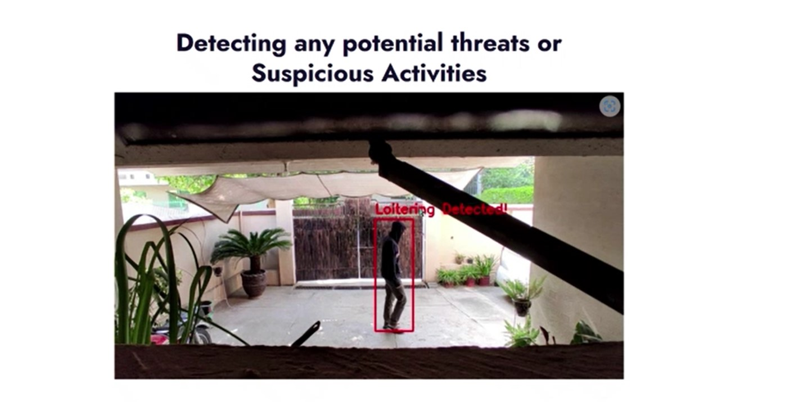
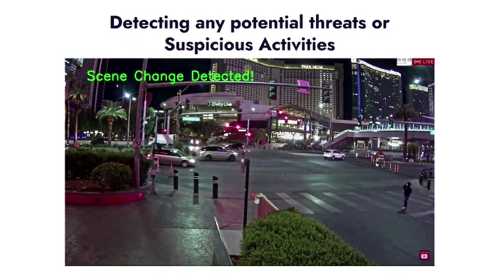
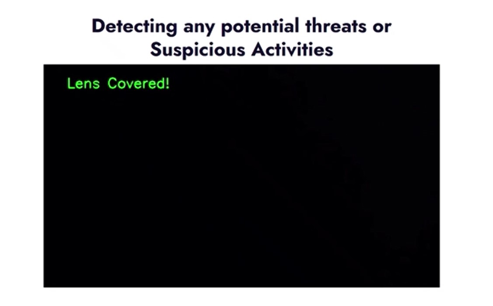

# ASFS [Auto Surveillance For Security]

Our web-based application is useful in detecting threat on publicly accessible places. This system will serve the purpose of auto surveillance using CCTV cameras. Threat could be a detected gun, shooting, or explosion at some public place. Most of the time, threats are detectable even before it happens. 

Classes Implemented Uptil Now:
* Loitering Detection
* Baggage Abandonment Detection
* Lens Coverage Detection
* Scene Change Detection

## Loitering Detection

## Scene Change Detection

## Lens Covered Detection

